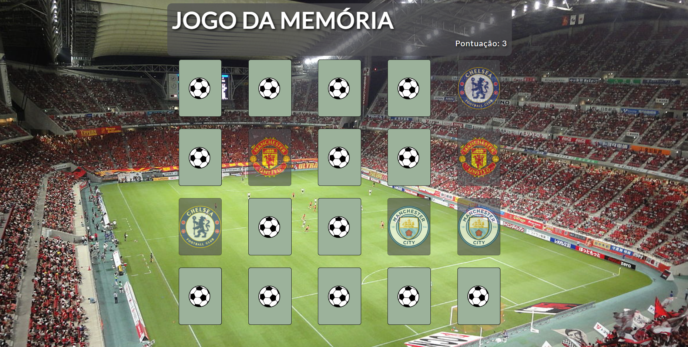

<h1 align="center">Jogo da memória</h1>

Projeto de jogo da memória com o tema de times internacionais, usando apenas HTML, CSS e JavaScript

---

**
Sumário:
**

<a href="#sobre">Sobre</a> |
<a href="#funcionalidades">Funcionalidades</a> |
<a href="#tecnologias">Tecnologias</a> |
<a href="#serviços-usados">Serviços usados</a> |
<a href="#imagens">Imagens</a> |
<a href="#como-jogar">Como jogar</a> |
<a href="#pré-requisitos">Pré-requisitos</a> |
<a href="#links">Links</a> |
<a href="#autor">Autor</a>

## Sobre
Esse projeto foi um desafio concluído em 5 dias, cada dia era uma parte do jogo feita, e que durante esse período, ampliei ainda mais meus conhecimentos nessas técnologias.

## Funcionalidades
As principais funcionalidades do projeto são:

✅ Jogo da memória composto por 20 cartas;

✅ Contador que indica a pontuação do jogador.

## Tecnologias
* HTML5
* CSS3
* JavaScript

## Serviços usados
* GitHub
* Netlify (hospedagem do site)

## Imagens

## Como jogar
Para se divertir com o jogo, basta acessa-lo pelo link, que seu navegador já irá abri-lo. Depois de aberto, basta clicar para tentar adivinhar o par de cada carta (cada carta é um time). Caso acerte, você ganhará um ponto. Assim que acertar todos os pares, será exibida uma mensagem que você ganhou.

## Pré requisitos
Para abrir o jogo, basta apenas o uso de um navegador de sua preferência.

## Links
* Jogar: https://jogo-da-memoria-times.netlify.app/
* Repositório: https://github.com/CaioAugustoHD/Jogo-da-memoria

## Autor
✨ Feito por Caio Augusto!!!

* caioaugustosbs@gmail.com
* <a href="https://www.linkedin.com/in/caio-augusto-cap/" target=”_blank”>LinkedIn</a>
* <a href="https://github.com/CaioAugustoHD" target=”_blank”>GitHub</a>
